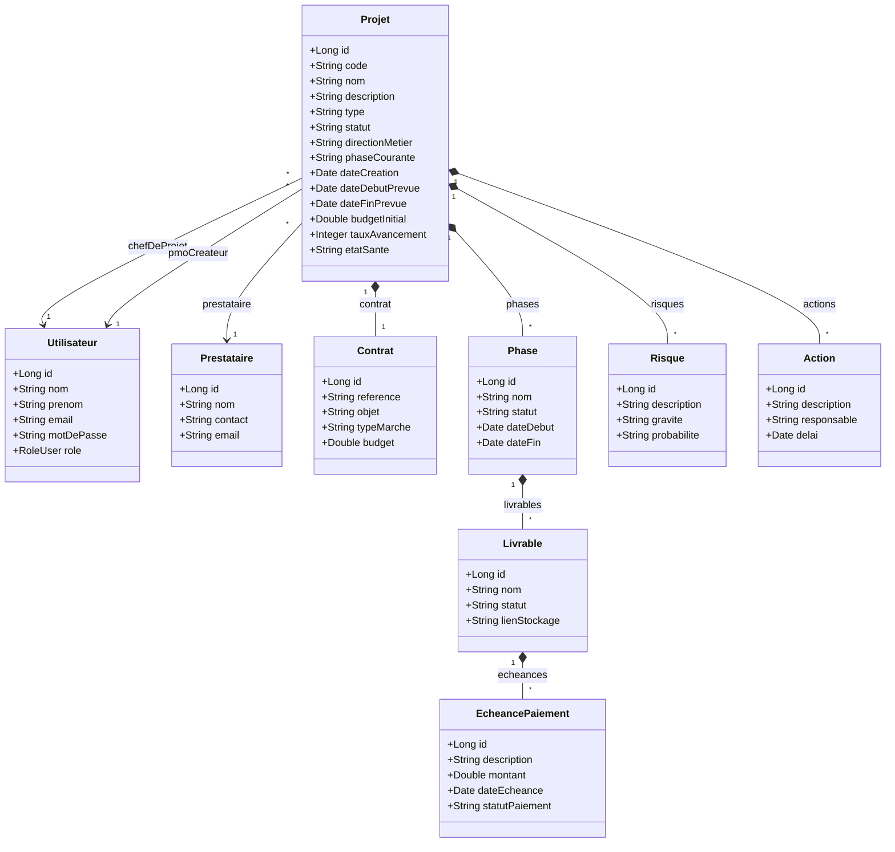

# Diagrammes UML - Système Référentiel SI

Voici les diagrammes modélisant l'architecture et les interactions de votre application.

## 1. Diagramme de Cas d'Utilisation

Ce diagramme illustre les interactions possibles entre les différents rôles (Acteurs) et le système.

```mermaid
usecaseDiagram
    actor "Administrateur" as Admin
    actor "PMO" as PMO
    actor "Chef de Projet" as CDP

    rectangle "Système Référentiel SI" {
        usecase "S'authentifier (SSO Keycloak)" as UC_Auth
        usecase "Consulter le Dashboard" as UC_Dash
        
        usecase "Gérer les Utilisateurs" as UC_Users
        usecase "Gérer les Référentiels (Listes)" as UC_Ref
        
        usecase "Créer un nouveau projet" as UC_CreateProj
        usecase "Assigner un Chef de Projet" as UC_Assign
        usecase "Superviser tous les projets" as UC_Supervise
        
        usecase "Gérer ses propres projets" as UC_ManageProj
        usecase "Importer une Fiche de Suivi (OCR PDF)" as UC_OCR
        usecase "Gérer le budget et paiements" as UC_Budget
        usecase "Déclarer Risques & Actions" as UC_Risks
    }

    Admin --> UC_Auth
    PMO --> UC_Auth
    CDP --> UC_Auth

    Admin --> UC_Users
    Admin --> UC_Ref
    Admin --> UC_Dash

    PMO --> UC_CreateProj
    PMO --> UC_Assign
    PMO --> UC_Supervise
    PMO --> UC_Dash

    CDP --> UC_ManageProj
    CDP --> UC_OCR
    CDP --> UC_Budget
    CDP --> UC_Risks
    CDP --> UC_Dash
```

---

## 2. Diagramme de Classes (Backend - Entités Spring Boot)

Ce diagramme représente la structure de la base de données PostgreSQL et les relations entre les principales entités du projet.


